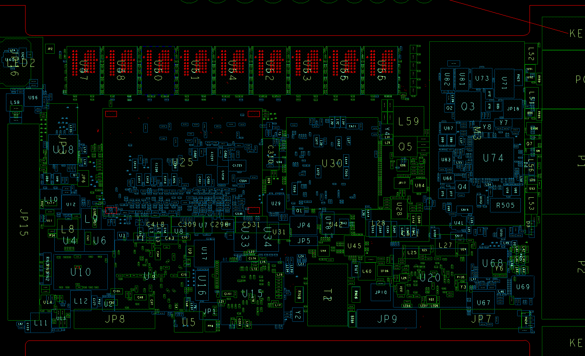
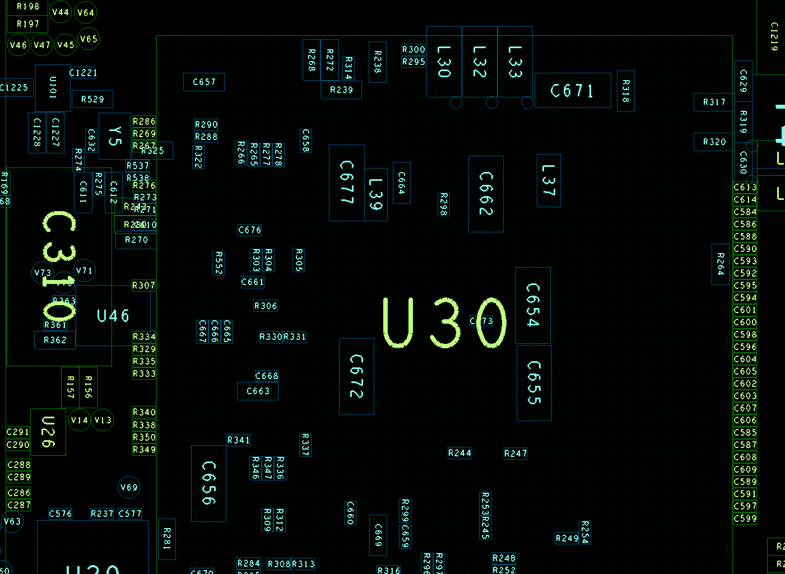
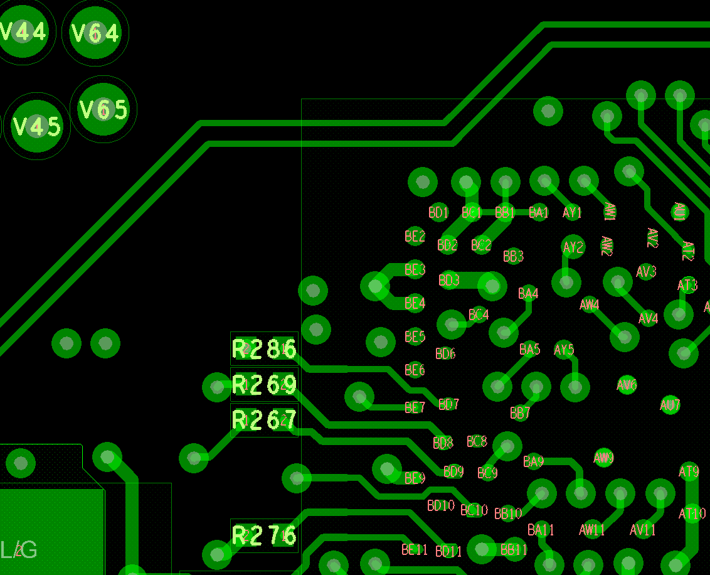

# OrCAD  / Allegro PCB Layout Review Beautifier 

The project provides a script and GUI that makes a PCB layout, created in either [OrCAD](https://www.orcad.com/) or [Allgero](https://www.cadence.com/en_US/home/tools/pcb-design-and-analysis/pcb-layout/allegro-pcb-designer.html) much easier to read and review. It is also great for hardware debugging.  Note that the OrCAD and Allegro PCB layout tools are [both owned by Cadence and use interchangeable file formats](https://community.cadence.com/cadence_technology_forums/f/pcb-design/22857/orcad-vs-allegro).

* *It has NO effect on the fabrication and manufacturing layers (eg ASSEMBLY, SILKSCREEN)*
* orients, centers, and automatically sizes the REFDES's and pin designations on the TOP DISPLAY layer
* orients, changes to forward direction, centers, and automatically sizes the REFDES's and pin designations on the BOTTOM DISPLAY layer
* gives easy control of the colors used for the display layer via a set of three +/- buttons for Hue, Saturation, and Lightness ([HSL](https://en.wikipedia.org/wiki/HSL_and_HSV)).

The script is written in [Cadence SKILL](https://en.wikipedia.org/wiki/Cadence_SKILL), which is a variant of [Lisp](https://en.wikipedia.org/wiki/Lisp_(programming_language)).

## INSTALATION 

### OrCAD

1. Copy `PCBReview.il` to your `C:\Cadence\setup\skill` folder. This is the Skill script.
2. Merge `allegro.ilinit` with the file of the same name in your `C:\Cadence\VERSION\pcbenv` folder, or copy if none exists.  This file loads all the scripts in the `C:\Cadence\setup\skill` folder during initialization of the OrCAD Layout application.  (`allegro.ilinit` is the initialization file for OrCAD Layout.)

### Allegro

1. Copy `PCBReview.il` to your `C:\Cadence\setup\skill` folder. This is the Skill script.
2. Merge `allegro.ilinit` with the file of the same name in your `C:\Cadence\VERSION\pcbenv` folder, or copy if none exists.  This file loads all the scripts in the `C:\Cadence\setup\skill` folder during initialization of the OrCAD Layout application.  (`allegro.ilinit` is the initialization file for OrCAD Layout.)

## USAGE 

1. Open the OrCAD layout tool.
2. Type `PCBReview` at the OrCAD layout command prompt.
3. The modifications to the DISPLAY layers described above will take place.
4. Afterward completion, the following popup window will appear which allows control of the colors and other display features.

## EXAMPLE RESULT

