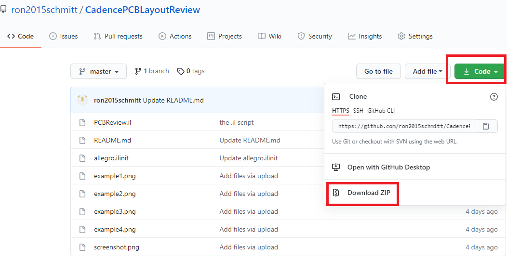

# OrCAD  / Cadence Allegro PCB Layout Review Beautifier 

This project provides a script and GUI that makes a PCB layout, created in either [OrCAD](https://www.orcad.com/) or [Allgero](https://www.cadence.com/en_US/home/tools/pcb-design-and-analysis/pcb-layout/allegro-pcb-designer.html) much easier to read and review. It is also great for hardware debugging.  Note that the OrCAD and Allegro PCB layout tools are [both sold by Cadence and use interchangeable file formats](https://community.cadence.com/cadence_technology_forums/f/pcb-design/22857/orcad-vs-allegro).

* *It has NO effect on the fabrication and manufacturing layers (eg ASSEMBLY, SILKSCREEN)*
* orients, centers, and automatically sizes the REFDES's and pin designations on the TOP DISPLAY layer
* orients, changes to forward direction, centers, and automatically sizes the REFDES's and pin designations on the BOTTOM DISPLAY layer
* gives easy control of the colors used for the display layer via a set of three +/- buttons for Hue, Saturation, and Lightness ([HSL](https://en.wikipedia.org/wiki/HSL_and_HSV)).

The script is written in [Cadence SKILL](https://en.wikipedia.org/wiki/Cadence_SKILL), which is a variant of [Lisp](https://en.wikipedia.org/wiki/Lisp_(programming_language)).

## INSTALLATION 

1. Download the zip file for this github repositiory by clicking the `Code` button above and selecting `Download ZIP`.

2. Unzip the downloaded `.zip` file to any location that you like.
3. The Skill script `PCBReview.il` is the only file that you need. This script will run from any folder.  Of course, if your installation has a skill folder, e.g `C:\Cadence\[VERSION]\setup\skill`, you can copy the file `PCBReview.il` there.

## USAGE 

1. Open the OrCAD (or allegro) layout tool and open the layout that you wish to view / edit.
2. Go to to `Command` window inside OrCAD (or allegro) layout and type 
```
skill
load "[path]/PCBReview.il" 
pcbreview
```
where `[path]` is the full path to the folder that you saved the `PCBReview.il` file to.  Note that in your path you MUST use forward slashes ('/') and NOT backslahses ('\\').  The use of double quotes surrounding the `"[path]/filename"` is also required.

3. The modifications to the DISPLAY layers described above will take place.
4. Afterward completion, the following popup window will appear which allows control of the colors and other display features.


### allegro.ilinit [optional]

This step is optional.

1. Place the load command above in your `allegro.ilinit` initialization file for OrCAD Layout.  This is typically located in a folder named `PCBENV\` or `pcbenv\`.
or
2. Merge the contents of `allegro.ilinit` from this repository with the your `allegro.ilinit` initialization file for OrCAD Layout.  This file loads all the scripts in the `C:\Cadence\setup\skill` folder during initialization of the OrCAD Layout application.  (`allegro.ilinit` is the initialization file for OrCAD Layout.)  Be sure to change  `C:\Cadence\setup\skill` to the path where your skill scripts reside.

## EXAMPLE RESULT


