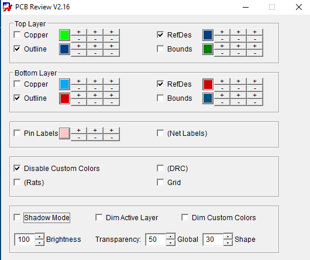

# CadencePCBLayoutReview
GUI that provides functionality making Cadence PCBs Layout much easier to read and review.  

*It has NO effect on the layers used for fabrication*.

* centers and automatically sizes the 

The script is written in [Cadence SKILL](https://en.wikipedia.org/wiki/Cadence_SKILL), which is a variant of Lisp.

## INSTALLTION

1. place `PCBReview.il` file in the `Cadence\setup\skill` folder
2. place `PCBReview.il` file in the `SPB_Data\pcbenv` folder
